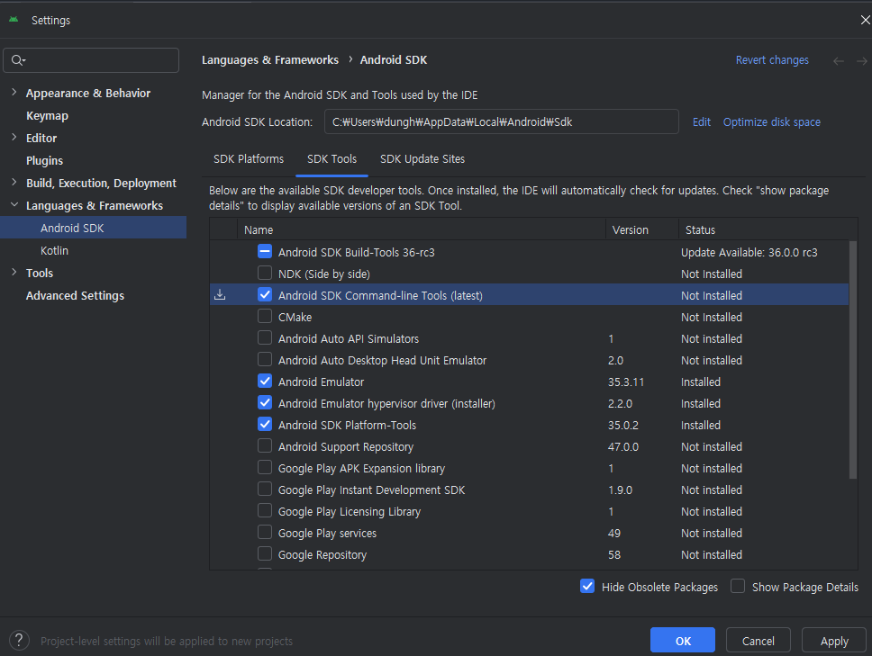
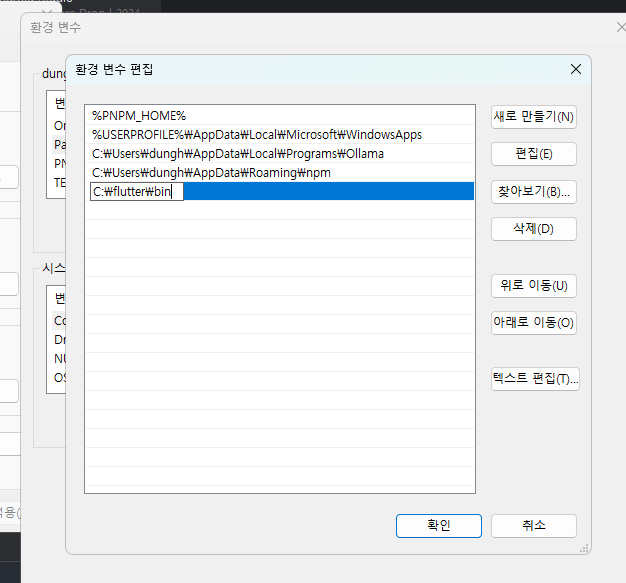
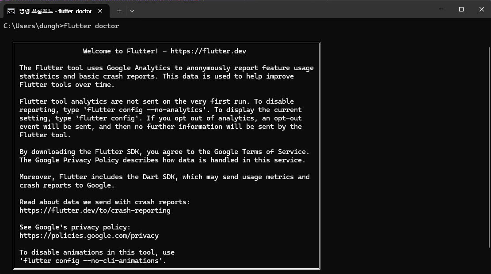
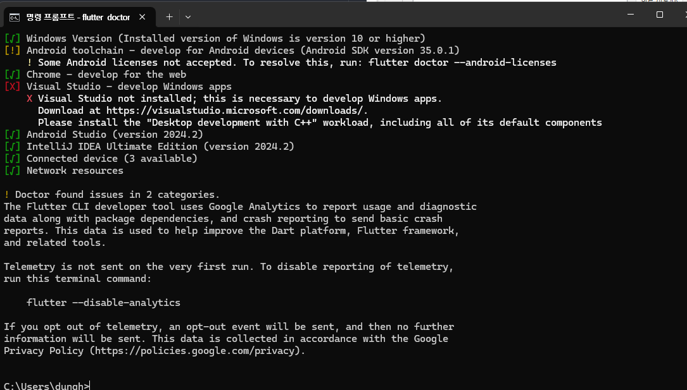
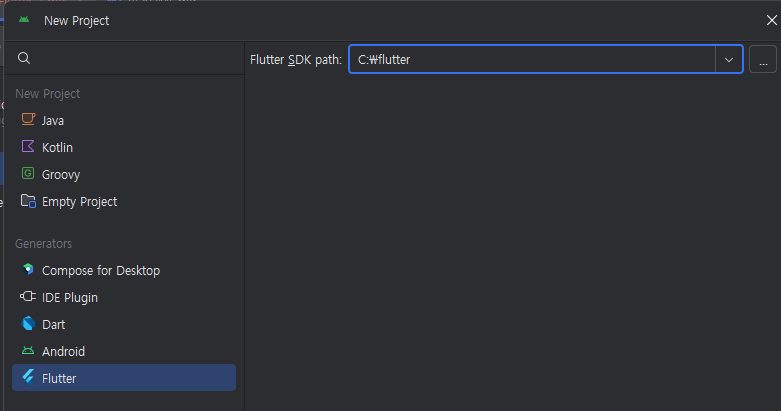
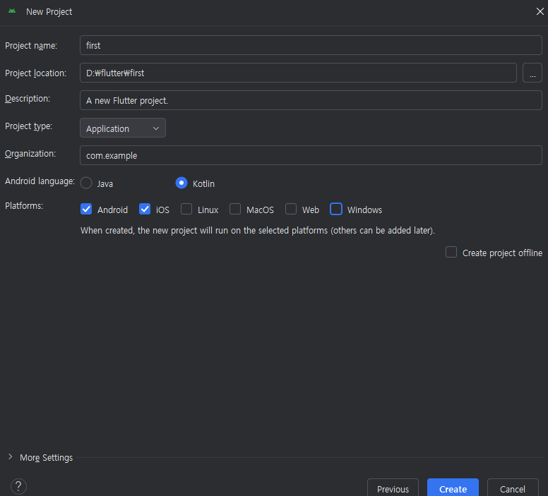
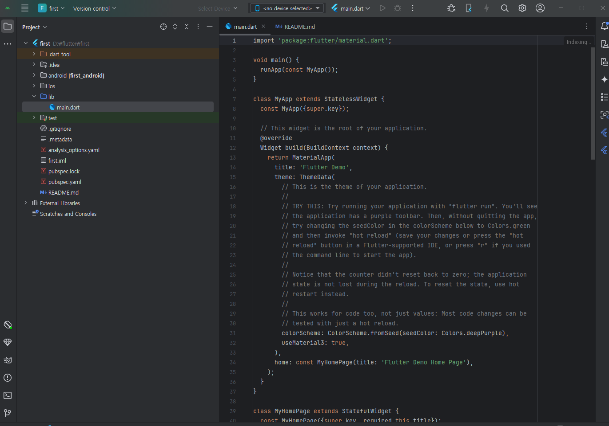

# Flutter

플러터는 Dart 언어를 사용하여 모바일 앱을 개발할 수 있는 프레임워크이다. 
플러터는 구글에서 개발하였으며, 2017년에 처음으로 발표되었다. 
플러터는 크로스 플랫폼 프레임워크로, 안드로이드와 iOS 모두에서 동작하는 앱을 만들 수 있다. 
플러터는 위젯을 사용하여 UI를 구성하며, 위젯은 모두 렌더링이 가능하다. 
또한, 플러터는 Hot Reload를 지원하여 앱을 빠르게 개발할 수 있다.

### Dart 언어란?
구글에서 개발한 언어로 클라이언트 앱을 개발하기 위해 설계된 언어.
JIT(Just In Time) 컴파일러와 AOT(Ahead Of Time) 컴파일러를 모두 지원한다.
JIT란 코드를 실행하기 전에 컴파일하는 방식이고, AOT는 미리 컴파일하여 실행하는 방식이다.
객체지향 언어로 Java와 유사하며, Java와 비교하여 간결하고 쉬운 문법을 가지고 있다
=> 이걸 보고 선택하게 되었다.

### 개발 환경 구성
- 플러터는 IntelliJ IDEA, Android Studio, VS Code 등의 IDE를 사용하여 개발할 수 있다.
- 하지만 안드로이드 스튜디오를 사용하는 것을 권장 (플러터, 다트 플러그인, 핫 리로드 등을 지원)
- 안드로이드 스튜디오 설치 후, 플러터 플러그인을 설치하면 플러터 프로젝트를 생성할 수 있다.

윈도우 환경에서 플러터 개발 환경을 먼저 구성해보자.

### 플러터 SDK 설치
1. [플러터 SDK 다운로드](https://docs.flutter.dev/release/archive?tab=windows)
   (2025. 1. 14. 기준 플러터 3.27.2 버전)
2. 다운로드한 파일을 압축 해제한 후, 원하는 경로 (C:\flutter) 에 저장한다.

### 안드로이드 스튜디오 설치
안드로이드 스튜디오를 학부 시절에 사용해봤던 기억이 있었는데 생각보다 ui가 많이 변한것 같다.
잡설은 이정도로 하고, 안드로이드 스튜디오를 설치해보자.

1. [안드로이드 스튜디오 다운로드](https://developer.android.com/studio?hl=ko)
2. 다운로드한 파일을 실행하여 설치한다.

### 플러터 플러그인 설치
1. 안드로이드 스튜디오 실행 후, Configure > Plugins 메뉴로 이동한다.
2. Marketplace -> Flutter 플러그인을 검색하여 설치한다.

### SDK 설정

SDK Manager -> Android SDK Command-line tools 설치

### 환경 변수 설정

시스템 환경 변수 -> Path -> 플러터 SDK 경로 (C:\flutter\bin) 추가

명령 프롬프트에서 flutter doctor 명령어를 실행하여 설치 상태를 확인한다.

### 플러터 프로젝트 생성

1. 안드로이드 스튜디오 실행 후, Create New Flutter Project를 선택한다.

2. 플러터 sdk 경로를 설정한다.

3. 프로젝트 이름 및 상세 설정 후에 Create 클릭

4. 프로젝트 생성 완료